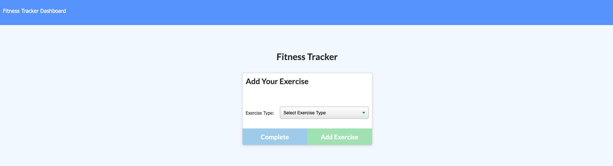

# Fitness-Tracker

## Description

  Welcome to the new Fitness Tracker! This newly designed health and wellness app makes it simple to keep your workout goals on track! Within this application, you can view create and track daily workouts. Additionally, you can log multiple exercises in a workout on a given day and are also able to track the name, type, weight, sets, reps, and duration of each exercise. Fitness Tracker was created using HTML, CSS, MongoDB, Mongoose, Node and Express. Please enjoy the new tracking functionality and we hope you visit again!

  

  ## Table of Contents
  
  - [Installation](#installation)
  - [Testing](#tests)
  - [Usage](#usage)
  - [License](#license)
  - [Contributors](#contributors)
  - [Link to Deployed Application](#link)
  - [Questions](#questions)

  ## Installation

  - Run Command: npm install
  - Start Command: node server.js

  ## Tests
  
  - Run Command: None

  ## Usage

  - This application will run through the command line using node.js, express.js while accessing a database using Mongoose and MongoDB. Please see installation instructions and tests for more information.

  ## License

  

  ## Contributors

  - None

  ## Link

  - 

  ## Questions? 
  
  - Feel free to contact me at ksmera01@gmail.com